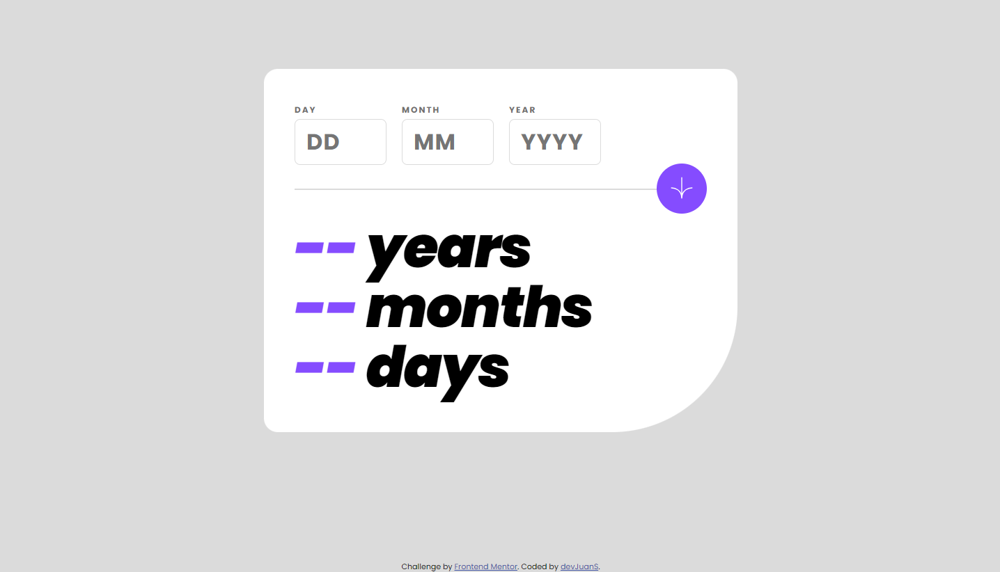
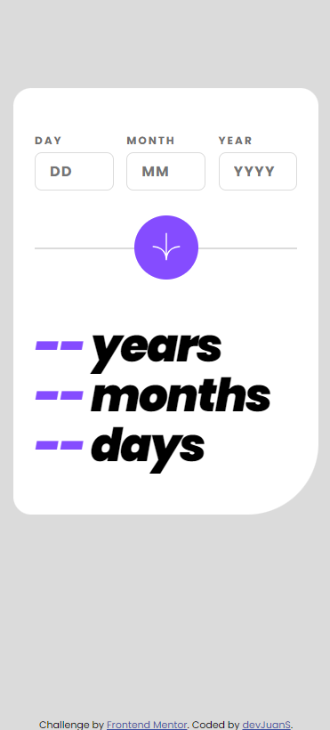

# Frontend Mentor - Age calculator app solution

This is a solution to the [Age calculator app challenge on Frontend Mentor](https://www.frontendmentor.io/challenges/age-calculator-app-dF9DFFpj-Q). Frontend Mentor challenges help you improve your coding skills by building realistic projects. 

## Table of contents

- [Overview](#overview)
  - [The challenge](#the-challenge)
  - [Screenshot](#screenshot)
  - [Links](#links)
- [My process](#my-process)
  - [Built with](#built-with)
  - [What I learned](#what-i-learned)
  - [Useful resources](#useful-resources)
- [Author](#author)
- [Acknowledgments](#acknowledgments)


## Overview

### The challenge

Users should be able to:

- View an age in years, months, and days after submitting a valid date through the form
- Receive validation errors if:
  - Any field is empty when the form is submitted
  - The day number is not between 1-31
  - The month number is not between 1-12
  - The year is in the future
  - The date is invalid e.g. 31/04/1991 (there are 30 days in April)
- View the optimal layout for the interface depending on their device's screen size
- See hover and focus states for all interactive elements on the page
- **Bonus**: See the age numbers animate to their final number when the form is submitted

### Screenshot

- Desktop screenshot

  
- Mobile screenshot

   

### Links

- Solution URL: [https://github.com/devJuanS/frontend-mentor/tree/main/age-calculator-app](https://github.com/devJuanS/frontend-mentor/tree/main/age-calculator-app)
- Live Site URL: [https://devjuans.github.io/frontend-mentor/age-calculator-app](https://devjuans.github.io/frontend-mentor/age-calculator-app)

## My process

### Built with

- Semantic HTML5 markup
- CSS custom properties
- Mobile-first workflow
- Vanilla JavaScript

### What I learned

- How to remove arrows/spinners in the input fields when is the type number. Thanks to [W3 Schools](https://www.w3schools.com/howto/howto_css_hide_arrow_number.asp):
  ```css
  /* Chrome, Safari, Edge, Opera */
  input::-webkit-outer-spin-button,
  input::-webkit-inner-spin-button {
    -webkit-appearance: none;
    margin: 0;
  }
  ```
- How to validate the day entered by user through regular expressions. Thanks to [Regex Generator site](https://regex-generator.olafneumann.org/) by [Olaf Neumann](https://github.com/noxone/):
  ```js
  function useRegex(input) {
    let regex = /^(0?[1-9]|[12][0-9]|3[01])$/i;
    return regex.test(input);
  }
  ```
  Applied in my code:
  ```js
  const isDayValid = (day, month, year) => {
    let regexMonthDay = /^(0?[1-9]|[12][0-9]|3[01])$/i;
    let maxDayinMonth;

    if ( !regexMonthDay.test(day) ) return false;

    if ( +month === 2 ) {
      maxDayinMonth = isLeap(+year) ? 29 : 28;  
    } else {
      maxDayinMonth = ((+month % 7) % 2) === 0 ? 30 : 31;
    }

    return (+day > 0 && +day <= maxDayinMonth);
  }
  ```
- Use ``e.preventDefault()`` to prevent form reload from submitting. This to use when there is some error with the entered data.

### Useful resources

- [How to Determine the Number of Days in a Month with JavaScript?](https://javascript.plainenglish.io/how-to-determine-the-number-of-days-in-a-month-with-javascript-3d837575a398) - This article in Medium from [John Au-Yeung](https://hohanga.medium.com/) helped me to find how to determine the number of days in a month in an easy form using the method ``getDate()``.
- [Subtract Months from a Date in JavaScript](https://bobbyhadz.com/blog/javascript-date-subtract-months) - Thanks to [Borislav Hadzhiev](https://bobbyhadz.com/about) because your article gave me an excellent solution for me to subtract months to a date.

## Author

- GitHub - [devJuanS](https://github.com/devJuanS)
- Frontend Mentor - [@devJuanS](https://www.frontendmentor.io/profile/devJuanS)

## Acknowledgments

Thanks to [Olaf Neumann](https://github.com/noxone/), [John Au-Yeung](https://hohanga.medium.com/) and [Borislav Hadzhiev](https://bobbyhadz.com/about) for their shared resources (articles and web tools) that helped me to achieve a better solution to the challenge.