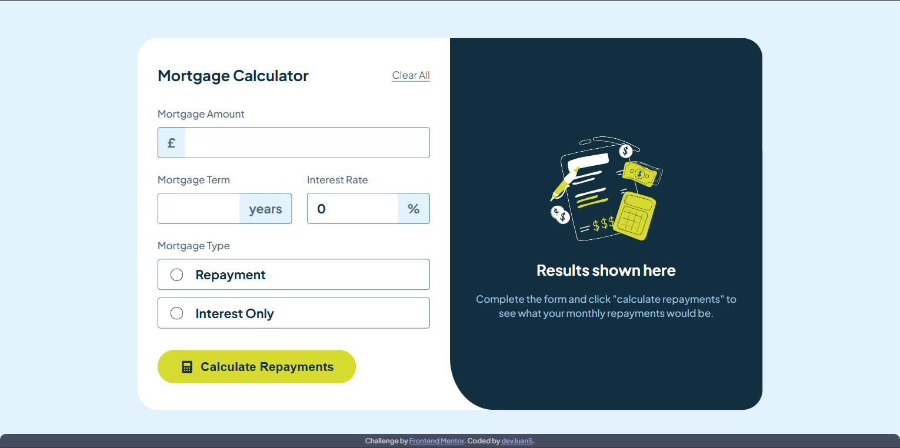
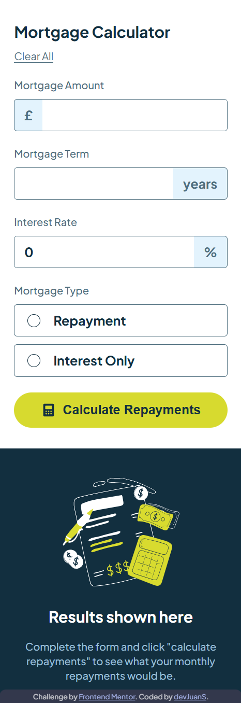

# Frontend Mentor - Mortgage Repayments Calculator solution

This is a solution to the [Mortgage repayments calculator challenge on Frontend Mentor](https://www.frontendmentor.io/challenges/mortgage-repayment-calculator-Galx1LXK73) using Vanilla JavaScript to improve my skills in the web development fundamentals.

## Table of contents

- [Overview](#overview)
  - [The challenge](#the-challenge)
  - [Screenshot](#screenshot)
  - [Links](#links)
- [My process](#my-process)
  - [Built with](#built-with)
  - [What I learned](#what-i-learned)
  - [Useful resources](#useful-resources)
- [Author](#author)
- [Acknowledgments](#acknowledgments)

## Overview

### The challenge

Users should be able to:

- Input mortgage information and see monthly repayment and total repayment amounts after submitting the form.
- See form validation messages if any field is incomplete.
- Complete the form only using their keyboard.
- View the optimal layout for the interface depending on their device's screen size.
- See hover and focus states for all interactive elements on the page.

### Screenshot

- Desktop screenshot



- Mobile screenshot



### Links

- Solution URL: []()
- Live Site URL: []()

## My process

### Tasks on development process

- [x] Render the form to enter information for calculation.
- [x] Validate the form inputs.
- [x] Calculate the monthly repayment and total repayment amounts with valid values.
- [x] Show errors messages for incomplete fields.
- [x] Render the results of calculation.
- [ ] Add styles.

### What I learned

- How to apply opacity only to `background-color` in an element when the color value is defined with variables:
  ```css
  background-color: hsl(from var(--color-primary) h s l / 0.3);
  ```

## Author

- GitHub - [devJuanS](https://github.com/devJuanS)
- Frontend Mentor - [@devJuanS](https://www.frontendmentor.io/profile/devJuanS)

## Acknowledgments

Thanks to ...

- Article [How to Calculate Mortgage Repayments](https://www.nerdwallet.com/au/home-loans/how-mortgage-repayments-work) written by [Alan Hartstein](https://www.nerdwallet.com/au/author/alan-hartstein) and [Georgia Rose](https://www.nerdwallet.com/au/author/georgia-rose).
- App [Mortgage calculator](https://tools.moneyhelper.org.uk/en/mortgage-calculator) by [MoneyHelper](https://moneyhelper.org.uk/).
