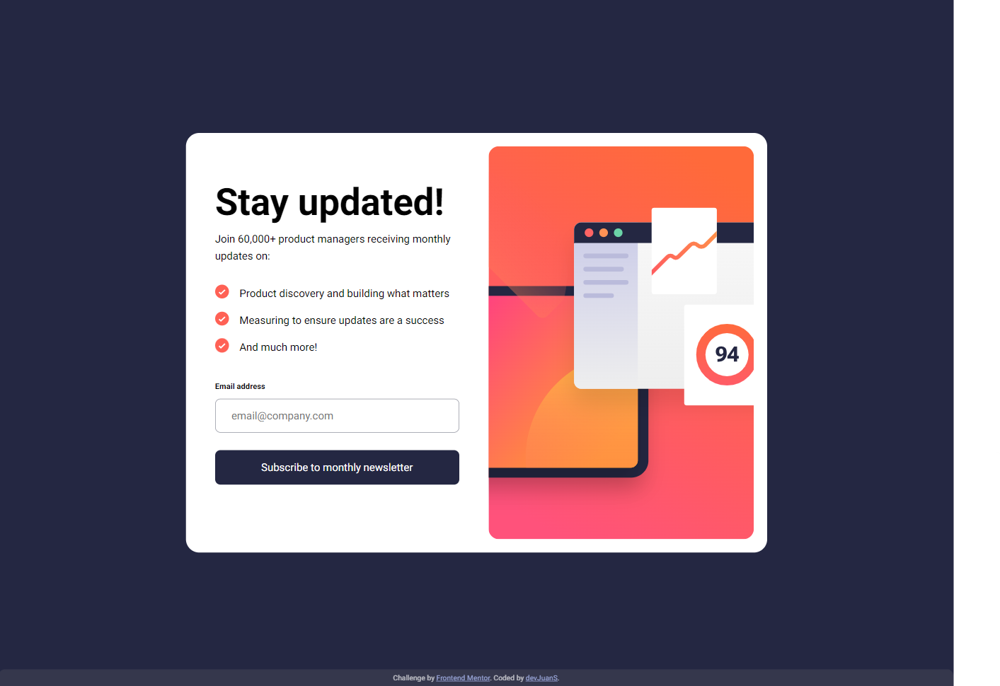

# Frontend Mentor - Newsletter sign-up form with success message solution

This is a solution to the [Newsletter sign-up form with success message challenge on Frontend Mentor](https://www.frontendmentor.io/challenges/newsletter-signup-form-with-success-message-3FC1AZbNrv). Frontend Mentor challenges help you improve your coding skills by building realistic projects. 

## Table of contents

- [Overview](#overview)
  - [The challenge](#the-challenge)
  - [Screenshot](#screenshot)
  - [Links](#links)
- [My process](#my-process)
  - [Built with](#built-with)
  - [What I learned](#what-i-learned)
  - [Useful resources](#useful-resources)
- [Author](#author)
- [Acknowledgments](#acknowledgments)

## Overview

### The challenge

Users should be able to:

- Add their email and submit the form
- See a success message with their email after successfully submitting the form
- See form validation messages if:
  - The field is left empty
  - The email address is not formatted correctly
- View the optimal layout for the interface depending on their device's screen size
- See hover and focus states for all interactive elements on the page

### Screenshot

- Desktop screenshot



- Mobile screenshot


### Links

- Solution URL: [https://github.com/devJuanS/frontend-mentor/tree/main/newsletter-sign-up](https://github.com/devJuanS/frontend-mentor/tree/main/newsletter-sign-up)
- Live Site URL: [https://devjuans.github.io/frontend-mentor/newsletter-sign-up](https://devjuans.github.io/frontend-mentor/newsletter-sign-up)

## My process

### Built with

- Semantic HTML5 markup
- CSS custom properties
- Mobile-first workflow
- Vanilla JavaScript
- JavaScript modules

### What I learned
- How to validate the email entered by a user through a regular expressions. Thanks to the site [©w3resource.com](https://www.w3resource.com/) for the article [JavaScript: HTML Form - email validation](https://www.w3resource.com/javascript/form/email-validation.php), where I took the regular expressions for my function as follow:
  ```js
  const isValidEmail = ( email ) => {
    if ( !email ) return false;
    let regex = /^\w+([\.-]?\w+)*@\w+([\.-]?\w+)*(\.\w{2,3})+$/;

    return regex.test(email);
  }
  ```
- How to style elements based on their contents using `:has()` CSS pseudo-class. Thanks to the article [The Power of `:has()` in CSS](https://css-tricks.com/the-power-of-has-in-css) published by [Chris DeMars](https://css-tricks.com/author/chrisdemars/) could use one sentence in CSS instead of add/remove a class with JavaScript to style the body when it its content there is the class `success-msg`:
  ```css
  body:has(.success-msg) {
    height: 100vh;
    display: flex;
    align-items: center;
    justify-content: center;
  }
  ```

### Useful resources
- The [Regex Generator site](https://regex-generator.olafneumann.org/) by [Olaf Neumann](https://github.com/noxone/) has been useful to generate and test regular expressions.
- The interactive demo about flexbox uses in the site [Flex Cheatsheet](https://yoksel.github.io/flex-cheatsheet/) by [Yoksel](https://github.com/yoksel).

## Author

- GitHub - [devJuanS](https://github.com/devJuanS)
- Frontend Mentor - [@devJuanS](https://www.frontendmentor.io/profile/devJuanS)

## Acknowledgments

Thanks to [Fernando Herrera](https://github.com/Klerith) for the knowledge delivered in his course in Spanish _[JavaScript Moderno: Guía para dominar el lenguaje](https://cursos.devtalles.com/courses/javascript-moderno)_. In that course, I have learned how to work with modules in JavaScript, and I hope I will use [Vite](https://vitejs.dev/) for the next challenge.