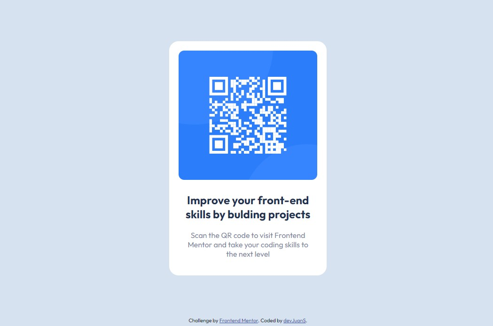

# Frontend Mentor - QR code component solution

This is a solution to the [QR code component challenge on Frontend Mentor](https://www.frontendmentor.io/challenges/qr-code-component-iux_sIO_H). Frontend Mentor challenges help you improve your coding skills by building realistic projects. 

## Table of contents

- [Overview](#overview)
  - [Screenshot](#screenshot)
  - [Links](#links)
- [My process](#my-process)
  - [Built with](#built-with)
  - [What I learned](#what-i-learned)
  - [Continued development](#continued-development)
  - [Useful resources](#useful-resources)
- [Author](#author)

## Overview

### Screenshot

### Links

- Solution URL: [Add solution URL here](https://github.com/devJuanS/frontend-mentor/tree/main/qr-code-component-main)
- Live Site URL: [Add live site URL here](https://devjuans.github.io/frontend-mentor/qr-code-component-main/)

## My process

### Built with

- Semantic HTML5 markup
- CSS custom properties
- Flexbox
- Mobile-first workflow

### What I learned

I've learned the basics about GitHub regarding to how to create a repository and to publish the solution of challenge on live site through [GitHub Pages](https://pages.github.com/). In relation to HTML and CSS, this challenge has been an enjoyable way to practice the basic concepts on semantic HTML5 to strucutre the page content and CSS to apply styles to develop the page as the challenge so requested.

### Continued development

The next steps are focusing me on learning about CSS Grid designs as well as improving the use of flex desings, and practice through more challenges to refine my skills.

### Useful resources

- [CSS Reference by W3 Schools](https://www.w3schools.com/cssref/default.asp) - I often check this site to clarify some doubts and to learn about properties that help to improve my skills.
- [GitHub Skills](https://skills.github.com/) - This helped me to [get started using GitHub](https://github.com/skills/introduction-to-github) and [create a site from my GitHub repositories](https://github.com/skills/github-pages) with [GitHub Pages](https://pages.github.com/). 

## Author

- GitHub - [devJuanS](https://github.com/devJuanS)
- Frontend Mentor - [@devJuanS](https://www.frontendmentor.io/profile/devJuanS)
- Twitter - [@js_echeverry](https://twitter.com/js_echeverry)
