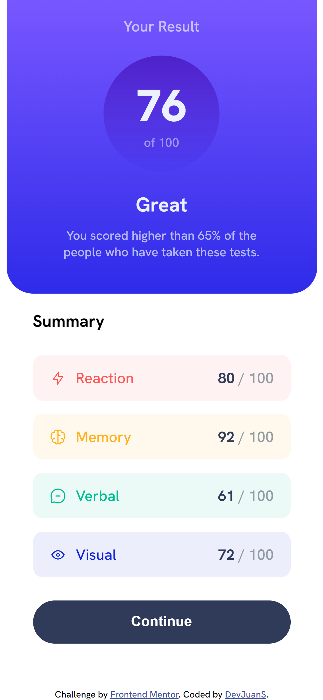
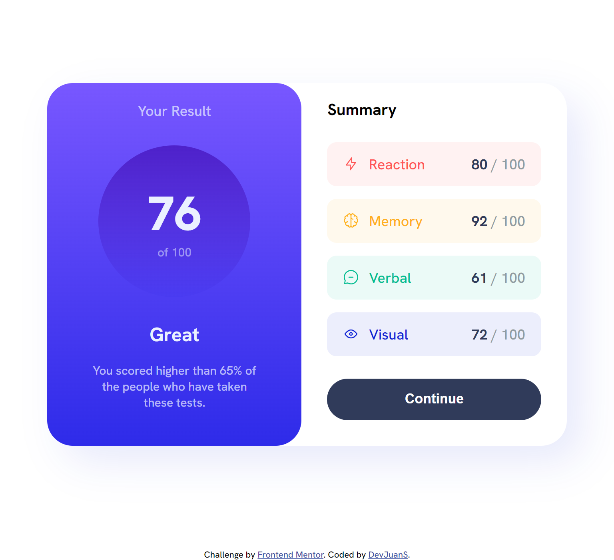

# Frontend Mentor - Results summary component

This is a solution to the [Results summary component challenge on Frontend Mentor](https://www.frontendmentor.io/challenges/results-summary-component-CE_K6s0maV).


## Table of contents

- [Overview](#overview)
  - [Screenshot](#screenshot)
  - [Links](#links)
- [My process](#my-process)
  - [Built with](#built-with)
  - [What I learned](#what-i-learned)
- [Author](#author)

## Overview

### Screenshot
 

### Links
- Solution URL: [https://github.com/devJuanS/frontend-mentor/tree/main/results-summary-component](https://github.com/devJuanS/frontend-mentor/tree/main/results-summary-component)
- Live Site URL: [https://devjuans.github.io/frontend-mentor/results-summary-component/](https://devjuans.github.io/frontend-mentor/results-summary-component/)

## My process

### Built with

- Semantic HTML5 markup
- CSS custom properties
- Flexbox
- Mobile-first workflow

### What I learned

With this challenge I have learned how to apply a gradient background to an element.

```css
.card-results {
    background: linear-gradient(0deg, var(--light-royal-blue), var(--light-slate-blue));
}
```

## Author

- GitHub - [devJuanS](https://github.com/devJuanS)
- Frontend Mentor - [@devJuanS](https://www.frontendmentor.io/profile/devJuanS)
- Twitter - [@js_echeverry](https://twitter.com/js_echeverry)
