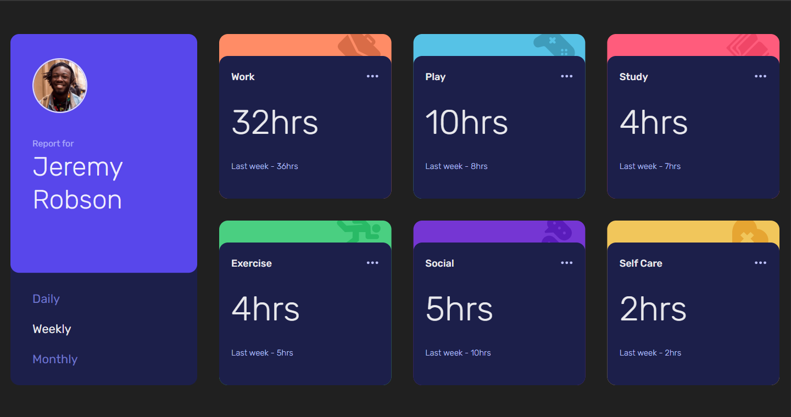
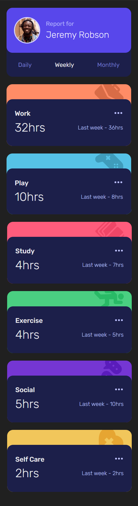

# Frontend Mentor - Time tracking dashboard solution

This is a solution to the [Time tracking dashboard challenge on Frontend Mentor](https://www.frontendmentor.io/challenges/time-tracking-dashboard-UIQ7167Jw). Frontend Mentor challenges help you improve your coding skills by building realistic projects. 

## Table of contents

- [Overview](#overview)
  - [The challenge](#the-challenge)
  - [Screenshot](#screenshot)
  - [Links](#links)
- [My process](#my-process)
  - [Built with](#built-with)
  - [What I learned](#what-i-learned)
  - [Continued development](#continued-development)
  - [Useful resources](#useful-resources)
- [Author](#author)
- [Acknowledgments](#acknowledgments)

## Overview

### The challenge

Users should be able to:

- View the optimal layout for the site depending on their device's screen size
- See hover states for all interactive elements on the page
- Switch between viewing Daily, Weekly, and Monthly stats

### Screenshot

- Desktop screenshot

  

- Mobile screenshot

  


### Links

- Solution URL: [https://github.com/devJuanS/frontend-mentor/tree/main/time-tracking-dashboard](https://github.com/devJuanS/frontend-mentor/tree/main/time-tracking-dashboard)
- Live Site URL: [https://time-tracking-fm.netlify.app](https://time-tracking-fm.netlify.app)

## My process

### Built with

- Semantic HTML5 markup
- CSS custom properties
- Flexbox
- CSS Grid
- Mobile-first workflow
- Vanilla JS web component
- [Vite](https://vitejs.dev/) - Build tool

### What I learned

- How to change the color of a SVG using as a mask instead of a background image. Thanks to [Chris Coyier](https://css-tricks.com/author/chriscoyier/) for the instructions in his article [Change Color of SVG on Hover](https://css-tricks.com/change-color-of-svg-on-hover/). View this in details in [here](https://css-tricks.com/change-color-of-svg-on-hover/#aa-use-a-mask-instead-of-a-background-image). The following was the style that was used:
  ```css
  .card-option {
    width: 2.4rem;
    height: 2.4rem;
    mask: url('/src/assets/icons/icon-ellipsis.svg');
    mask-repeat: no-repeat;
    mask-position: center;
    background: var(--pale-blue);
    cursor: pointer;
  }
  .card-option:hover { background: var(--font-color) }
  ```

- How to create a web component. In the articles from [Chris Ferdinandi](https://gomakethings.com/about/) and [Melike Kavcıoğlu](https://mellowdevs.medium.com/) cited under [Useful resources](#useful-resources) section, I found the necessary instructions to create a web component with vanilla JS that help me to code my first task card component to use in this challenge.

- How to import a component in a vanilla JavaScript project when using Vite. Thanks to [@AlexMercedCoder](https://www.alexmercedcoder.dev/) because with its video [AM Coder - Using Native Web Components with Vite (The New Hot Bundler in Town)](https://www.youtube.com/watch?v=AvAv-ObQWg4) I could resolve this doubt. The way to import a component in vanilla JS is adding this line in the main script JS (main.js in the case of this challenge):
  ```js
  import './src/components/task-card';
  ```
  ```md
  src
  ├── assets
  ├── components
  │   └── task-card.js <<
  ├── presentation
  └── time-track-app.js
  index.html
  main.js <<
  ...
  ```

### Continued development

I am interested in learning more about web components coding in vanilla JavaScript before learning a framework. And I have found useful the articles published by [Chris Ferdinandi](https://gomakethings.com/about/) in [GoMakeThings.com](https://gomakethings.com/articles/).

Furthermore, it will be great to work in a new challenge in which the states and CRUD processes can be implemented.

### Useful resources

- [A Complete Guide to CSS Grid](https://css-tricks.com/snippets/css/complete-guide-grid/) - This helped me to define the grid to render the task inside te dashboard. I liked this CSS feature because it makes easy to organize the elements in a grid that works fine in a responsive app.
- I found helpful the follow articles to understand how work the web components and how to create them:
  - [What are browser-native web components?](https://gomakethings.com/what-are-browser-native-web-components/) by [Chris Ferdinandi](https://gomakethings.com/about/)
  - [How to create a web component with vanilla JS](https://gomakethings.com/how-to-create-a-web-component-with-vanilla-js/) by [Chris Ferdinandi](https://gomakethings.com/about/)
  - [How to add interactivity to browser native web components with vanilla JS](https://gomakethings.com/how-to-add-interactivity-to-browser-native-web-components-with-vanilla-js/) by [Chris Ferdinandi](https://gomakethings.com/about/)
  - [Web Components Using Vanilla JS](https://mellowdevs.medium.com/web-components-using-vanilla-js-f7af00834caa) by [Melike Kavcıoğlu](https://mellowdevs.medium.com/)


## Author

- GitHub - [devJuanS](https://github.com/devJuanS)
- Frontend Mentor - [@devJuanS](https://www.frontendmentor.io/profile/devJuanS)

## Acknowledgments

Thanks to [Chris Ferdinandi](https://gomakethings.com/about/), [Melike Kavcıoğlu](https://mellowdevs.medium.com/), [Chris Coyier](https://css-tricks.com/author/chriscoyier/) because their publications have been useful to learn about web components and SVG.
